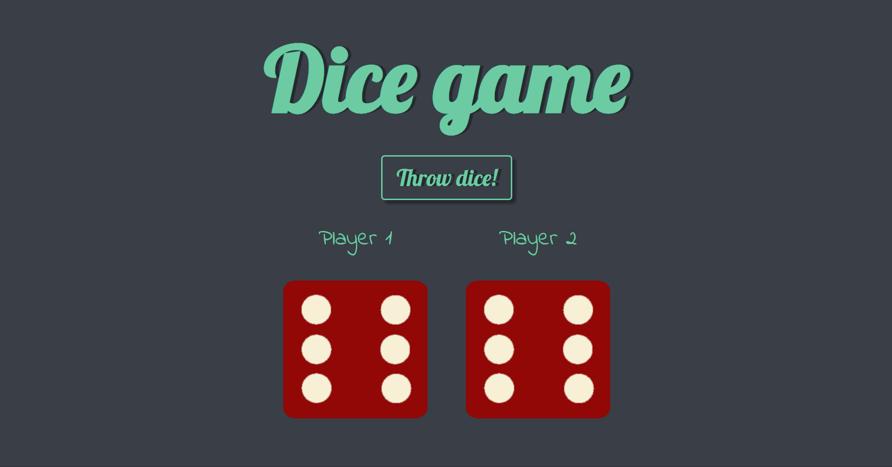

<h1>Dice game</h1>

This is a dice game I built as an exercise to practice JS functions and adding animations to websites in the beggining of my study in web development. 

I started from an exercise proposed by the course <a href="https://www.udemy.com/course/the-complete-web-development-bootcamp/?src=sac&kw=the+complete+2023">"The Complete 2023 Web Development Bootcamp"</a> and added some functionalities like the dice animation and the "Throw dice!" button.

<h2>Overview</h2>

<h3>The project</h3>

This is a dice game. Upon button click, two dice are rolled, the first for player 1 and the second for player 2. When both dice are shown, the page tells the game result: either a draw or a victory for player 1 or player 2.

<h3>Preview</h3>
<h4>Desktop</h4>

<h3>Link</h3>
<ul>
    <li>Live site URL: <a href="https://julianastahelin.github.io/dice-game/">https://julianastahelin.github.io/dice-game/</a></li>
</ul>

<h2>My process</h2>

<h3>Built with 👩🏽‍💻</h3>
<ul>
    <li>HTML 5;</li>
    <li>CSS 3;</li>
    <li>JS.</li>
</ul>

<h3>What I practiced 💪🏽</h3>
<ul>
    <li>Manipulating HTML element attributes using JS;</li>
    <li>Generation random numbers using JS;</li>
    <li>Using JS setTimeout function for building animations;</li>
    <li>Using CSS transform and transition.</li>
</ul>